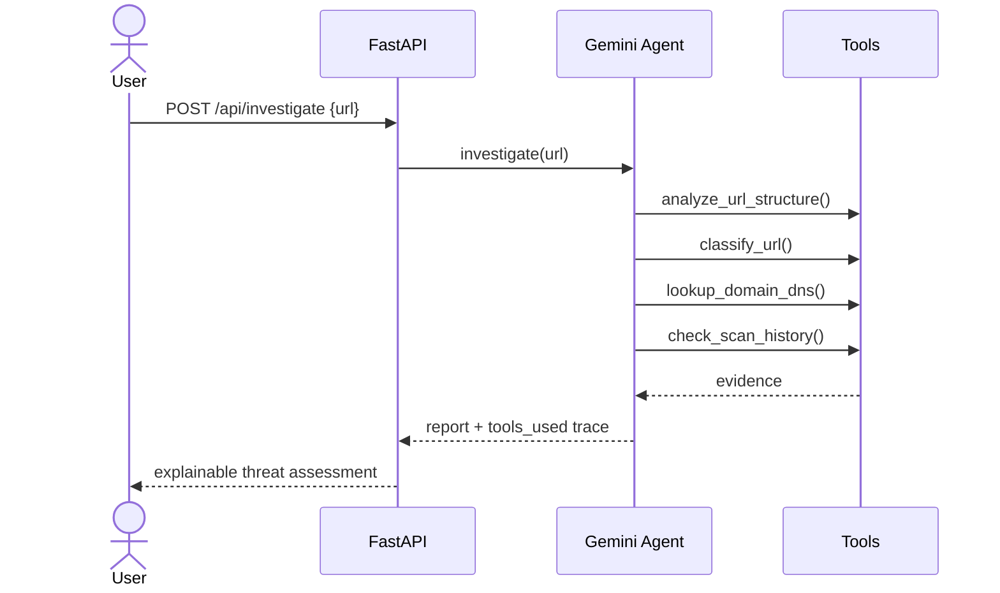

<div align="center">

# 🛡️ MLOps (Phishing)

### End-to-end MLOps pipeline for phishing detection — with an *agentic* Gemini threat analyst

[](https://github.com/saicharanrajoju/mlops-phishing/actions/workflows/ci.yml)


*Paste a URL → 30 features → ML verdict → an AI agent investigates with tools → explainable report — all behind a glassmorphic dashboard, with a full train → register → serve → monitor → retrain loop.*

</div>

---

## 🏗️ Architecture

```mermaid
flowchart LR
    DATA[("📦 Phishing dataset")]:::data --> ING["Data Ingestion"]:::comp
    ING --> VAL["Data Validation<br/>(schema + KS drift)"]:::comp
    VAL --> TRF["Data Transformation<br/>(impute + scale)"]:::comp
    TRF --> TRN["Model Trainer<br/>(GridSearch × 5 models)"]:::comp
    TRN -->|register version| REG{{"🏷️ MLflow Model Registry"}}:::reg
    REG -->|"@production · champion/challenger"| SRV["⚡ FastAPI serving"]:::serve
    SRV --> AGENT["🧠 Gemini threat agent"]:::ai
    AGENT -.->|calls tools| SRV
    SRV -->|"scans + 👍/👎 feedback"| STORE[("🗄️ SQLite / Supabase")]:::data
    STORE --> MON["📊 Drift Monitor<br/>KS + PSI"]:::comp
    MON -.->|retrain signal| ING

    classDef data fill:#fde2e4,stroke:#e5616e,color:#111;
    classDef comp fill:#e2eafc,stroke:#5a7fd6,color:#111;
    classDef reg fill:#fff1cc,stroke:#e0a800,color:#111;
    classDef serve fill:#d8f3dc,stroke:#40916c,color:#111;
    classDef ai fill:#efe1fb,stroke:#9d4edd,color:#111;
```



> The dashed arrow — **monitoring → drift → retrain** — is what makes this a *closed* MLOps loop, not a one-way pipeline. Per-stage diagrams live in [docs/ARCHITECTURE.md](docs/ARCHITECTURE.md).

---

## ✨ Highlights

- 🏷️ **MLflow Model Registry** as the source of truth — versioned models, **champion/challenger** promotion to a `@production` alias (not a hardcoded `.pkl`).
- 🧠 **Agentic AI** — the Gemini analyst doesn't just caption the output; it **autonomously calls tools** (features, classifier, DNS, history) and reasons to a verdict, returning the tool-call trace.
- 🎯 **Uncertainty-aware** — flags low-confidence verdicts near the decision boundary for human review.
- 🔁 **Active-learning loop** — 👍/👎 feedback is stored to seed retraining.
- 📊 **Drift monitoring** — KS-test + PSI report that signals when to retrain.
- 🧱 **Production hygiene** — training decoupled from serving, structured LLM output + graceful fallback, pinned deps, tests, Ruff, Docker, CI.

---

## 📸 Demo

> Capture these with the app running and drop the PNGs into `docs/images/` (filenames below) — they'll render here automatically. See [docs/images/README.md](docs/images/README.md).

| Threat dashboard | Agentic investigation | MLflow registry |
|:---:|:---:|:---:|
| `docs/images/dashboard.png` | `docs/images/agent.png` | `docs/images/mlflow.png` |

---

## 🛠️ Tech stack

| Concern | Tool |
|---|---|
| Modeling | scikit-learn, XGBoost (GridSearch over 5 classifiers) |
| Experiment tracking & **registry** | MLflow (DB-backed, alias-based promotion) |
| Serving | FastAPI + Uvicorn |
| Generative AI | Google Gemini (`google-genai`) + Pydantic structured output |
| **Agentic AI** | Gemini **automatic function calling** — the agent calls tools & reasons |
| Active learning | human-in-the-loop feedback loop |
| Data validation | schema checks + Kolmogorov–Smirnov drift |
| Monitoring | KS-test + Population Stability Index (PSI) |
| Persistence | Supabase / PostgreSQL → local SQLite fallback |
| Quality / CI | pytest, Ruff, pre-commit, Docker, GitHub Actions |

---

## 🚀 Quickstart

**Local**

```bash
pip install -r requirements.txt        # add requirements-dev.txt for tests/lint
cp .env.example .env                    # (optional) set GEMINI_API_KEY for live AI
python main.py                          # train → register → promote to @production
python app.py                           # serve → http://127.0.0.1:8000
mlflow ui --backend-store-uri sqlite:///mlflow.db   # (optional) registry UI
```

**Docker** — a real two-service stack (MLflow registry server + app):

```bash
cp .env.example .env
docker compose up --build
# app: http://localhost:8000   ·   mlflow: http://localhost:5000
```

**Cloud (Render, free)** — the repo ships a [`render.yaml`](render.yaml) blueprint and bundles
the champion model, so the demo works on first boot:

1. Push to GitHub → on [Render](https://render.com): **New → Blueprint** → connect this repo.
2. Render builds the Dockerfile and serves the app; `$PORT` is wired automatically.
3. (Optional) add `GEMINI_API_KEY` in the dashboard to enable the live AI agent.
4. Drop your live URL at the top of this README.

> Free instances cold-start in ~50s after idle.

---

## 🧠 How it works

### Model Registry (the source of truth)
Training composes the fitted preprocessor + best classifier into one native sklearn
`Pipeline`, registers a **version**, and `promote_if_better` only moves the `@production`
alias if the new test-F1 beats the current champion. Serving loads
`models:/...@production` **once at startup**, with a local-pickle fallback.

### Agentic investigation
`POST /api/investigate` runs a Gemini agent that decides which tools to call:



### Built-in intelligence
- **Uncertainty** — `/api/scan` returns `confidence` + `needs_review` near the 0.5 boundary.
- **Active learning** — `/api/feedback` records human corrections for retraining.

### Drift monitoring (closes the loop)
```bash
python -m phishsentinel.monitoring.drift_monitor --reference data/phisingData.csv --current new.csv
```
Per-feature KS + PSI with a JSON + HTML report — the signal to retrain.

---

## 🧪 Testing & CI

```bash
pytest -q          # unit + API smoke tests (fully offline)
ruff check .       # lint
ruff format .      # format
pre-commit install # run both on every commit
```
GitHub Actions runs lint + format-check + tests on every push/PR.

## ⚙️ Configuration

| Variable | Purpose | Default |
|---|---|---|
| `GEMINI_API_KEY` | live AI reports / agent / chatbot | _(fallback mode)_ |
| `MLFLOW_TRACKING_URI` | tracking + registry store | `sqlite:///mlflow.db` |
| `SUPABASE_URL` / `SUPABASE_KEY` | cloud scan logging | _(SQLite fallback)_ |
| `CORS_ALLOW_ORIGINS` | allowed API origins | localhost only |

---

## 🗺️ Roadmap

- **RAG threat-intel** — give the agent a knowledge-base tool to ground reports in real intel.
- **Langfuse** — trace agent runs (tools, latency, cost).
- **Real feature extraction** — WHOIS / HTML probes to replace heuristic features.
- **Auto-retrain** — trigger training from drift + accumulated feedback.
- **Google ADK** — port the agent to a multi-agent framework.

## 📁 Project layout

```
phishsentinel/        core package: components · pipeline · registry · monitoring
ai_analyst/           feature extractor · Gemini analyst · agent · schemas
templates/            glassmorphic dashboard
app.py                FastAPI serving layer (serving only)
main.py               training entrypoint
tests/                pytest suite
docs/                 architecture diagrams + screenshots
```
