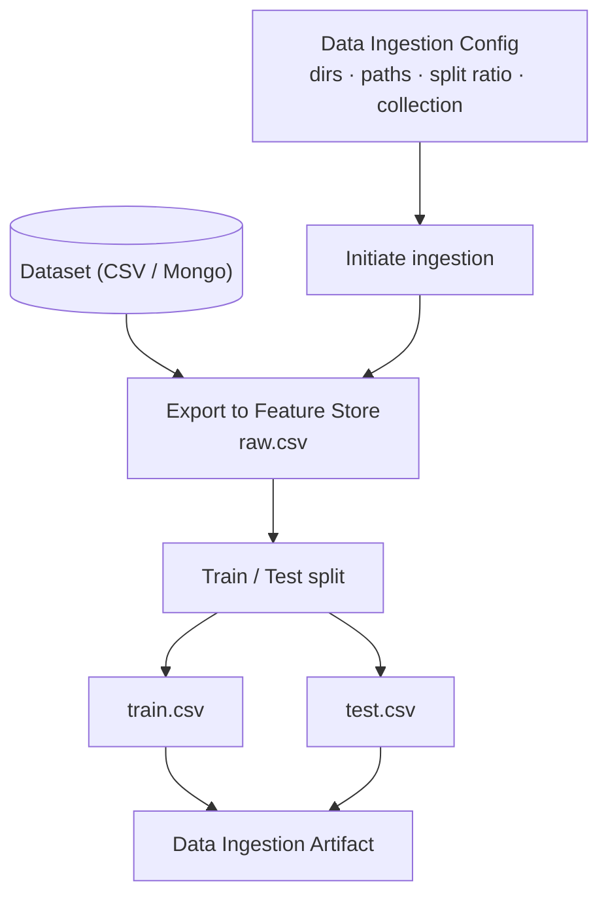
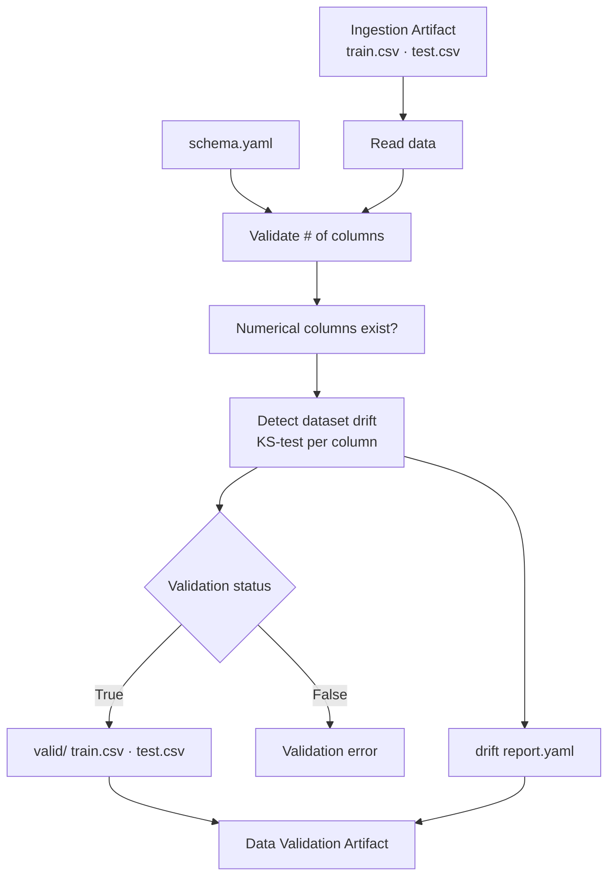
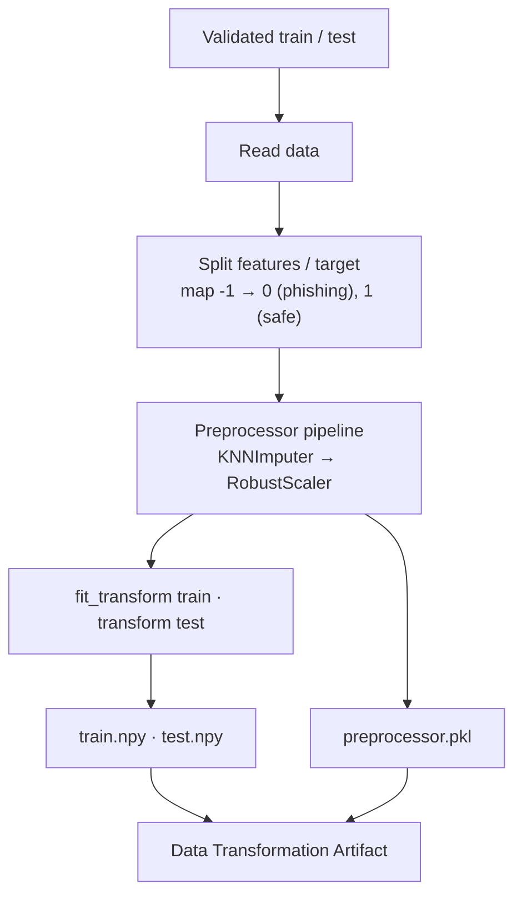
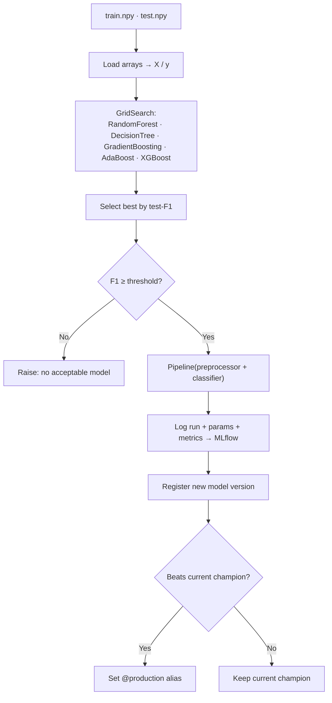
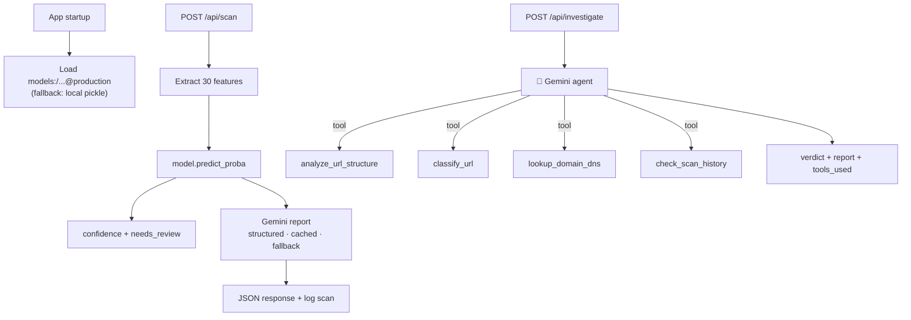
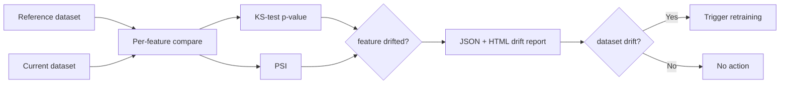

# Architecture — per-stage flow

Detailed diagrams for each stage of the **MLOps (Phishing)** pipeline. GitHub renders
these Mermaid diagrams natively. For the high-level loop, see the [README](../README.md).

---

## 1. Data Ingestion

## 2. Data Validation

## 3. Data Transformation

## 4. Model Trainer + Registry

## 5. Serving + Agent

## 6. Drift Monitoring (closes the loop)

